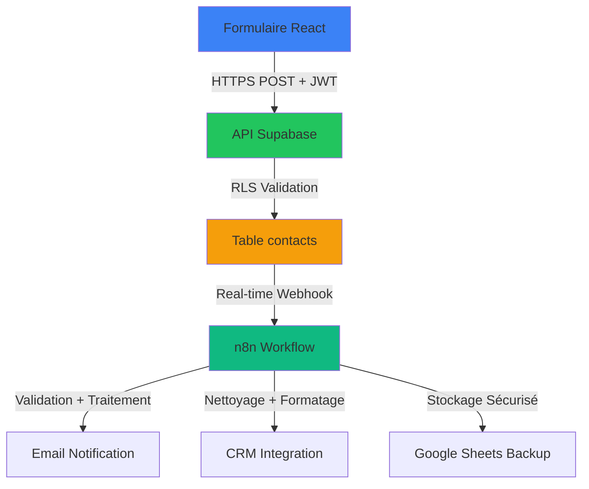

# Backend Formulaire Contact - Architecture n8n + Supabase

## 🎯 Vue d'Ensemble

**Formulaire React** → **Supabase API** → **Webhook n8n** → **Traitements**

Cette architecture combine la simplicité de Netlify pour le frontend avec la puissance de Supabase pour le stockage sécurisé et n8n pour l'automatisation.

## 🔐 Alternatives Netlify Forms

### Option A: Netlify Forms (Simple, Limitations)
```
Avantages:
✅ Configuration immédiate (aucun backend requis)
✅ Intégré directement dans le site
✅ Protection anti-spam de base

Inconvénients:
❌ Fonctionnalités limitées (pas de validation complexe)
❌ Stockage sur Netlify uniquement (pas de contrôle)
❌ Intégration limitée avec n8n (webhook simple)
❌ Pas de Row Level Security natif
❌ Backups limités
```

### Option B: Supabase API (Recommandée)
```
Avantages:
✅ Contrôle total sur les données
✅ Row Level Security (RLS) natif
✅ Authentification JWT sécurisée
✅ Intégration parfaite avec n8n
✅ Backups automatiques
✅ Monitoring intégré
✅ Scalabilité automatique

Inconvénients:
❌ Léger développement backend requis
❌ Configuration initiale nécessaire
```

## 🏗️ Architecture Recommandée

### Schéma Technique


### Flux Détaillé
1. **Soumission Formulaire** (Netlify Hosting)
   - Validation frontend (email, longueur, etc.)
   - Génération token CSRF si nécessaire
   - Appel API Supabase avec clé anon

2. **Stockage Supabase** (Database sécurisée)
   - Insertion dans table `contacts` avec RLS actif
   - Validation automatique par politiques PostgreSQL
   - Timestamp et métadonnées (IP, user-agent) enregistrées

3. **Déclenchement n8n** (Real-time)
   - Webhook écoutant les nouvelles insertions
   - Authentification Header Auth avec clé secrète
   - Validation et filtrage des données

4. **Traitements n8n** (Automatisation)
   - Sanitization avancée (nodes Guardrails)
   - Vérification anti-spam
   - Formatage et enrichissement données
   - Notifications multi-canaux

## 📋 Configuration Supabase

### Table Contacts
```sql
-- Table principale pour les soumissions
CREATE TABLE public.contacts (
    id uuid DEFAULT gen_random_uuid() PRIMARY KEY,
    nom text NOT NULL,
    prenom text,
    email text NOT NULL,
    telephone text,
    sujet text,
    message text NOT NULL,
    source_url text,           -- URL d'origine
    ip_address text,            -- Pour anti-spam
    user_agent text,             -- Pour analytics
    consent_rgpd boolean DEFAULT true,
    created_at timestamptz DEFAULT now(),
    processed boolean DEFAULT false,
    processed_at timestamptz,
    assigned_to text,             -- Pour suivi interne
    tags text[],                 -- Pour catégorisation
    priority integer DEFAULT 1     -- 1=Normal, 2=Urgent, 3=Critique
);

-- Activer Row Level Security
ALTER TABLE public.contacts ENABLE ROW LEVEL SECURITY;

-- Politique : Insertion par authentifiés uniquement
CREATE POLICY "Authenticated users can insert contacts" ON public.contacts
    FOR INSERT WITH CHECK (auth.role() = 'authenticated');

-- Politique : Lecture par services uniquement
CREATE POLICY "Service role can read all contacts" ON public.contacts
    FOR SELECT USING (auth.role() = 'service_role');

-- Politique : Mise à jour par administrateurs
CREATE POLICY "Admins can update contacts" ON public.contacts
    FOR UPDATE USING (auth.role() = 'admin');
```

### Politiques de Sécurité Avancées
```sql
-- Protection contre le spam automatique
CREATE POLICY "Rate limit contacts insertion" ON public.contacts
    FOR INSERT WITH CHECK (
        created_at > now() - interval '1 minute' OR
        auth.role() = 'service_role'
    );

-- Validation IP (optionnel avec extension)
CREATE POLICY "Allow only known IPs" ON public.contacts
    FOR INSERT WITH CHECK (
        client_ip IN ('192.168.1.1', '10.0.0.0/8') OR
        auth.role() = 'admin'
    );
```

## 🔧 Configuration n8n

### Workflow Type
```yaml
# n8n Workflow Configuration
name: "Traitement Formulaire Contact"
trigger:
  type: webhook
  httpMethod: POST
  path: "contact-submission"
  authentication:
    type: header
    name: Authorization
    value: "Bearer ${WEBHOOK_SECRET}"

nodes:
  # 1. Validation initiale
  - name: Validate Contact
    type: function
    code: |
      const data = $input.first().json;
      
      // Validation format email
      const emailRegex = /^[^\s@]+@[^\s@]+\.[^\s@]+$/;
      if (!emailRegex.test(data.email)) {
        throw new Error('Invalid email format');
      }
      
      // Validation anti-spam basique
      if (data.message && data.message.toLowerCase().includes('viagra')) {
        throw new Error('Potential spam detected');
      }
      
      return [{
        json: {
          ...data,
          validated: true,
          timestamp: new Date().toISOString()
        }
      }];

  # 2. Nettoyage et enrichissement
  - name: Sanitize Data
    type: sanitizeText
    mode: sanitize
    options:
      removePII: false
      removeLinks: true
      normalizeSpaces: true

  # 3. Notification Email
  - name: Send Email
    type: gmail
    parameters:
      to: "contact@visiontek.com"
      subject: "Nouvelle soumission formulaire: {{ $json.sujet }}"
      body: |
        Nom: {{ $json.nom }}
        Email: {{ $json.email }}
        Téléphone: {{ $json.telephone }}
        
        Message:
        {{ $json.message }}
        
        ---
        Soumis le: {{ $json.created_at }}
        IP: {{ $json.ip_address }}

  # 4. Stockage CRM
  - name: Update CRM
    type: httpRequest
    url: "https://votre-crm.com/api/contacts"
    method: POST
    headers:
      Authorization: "Bearer ${CRM_API_KEY}"
      Content-Type: "application/json"
    body: "{{ $json }}"

  # 5. Backup Google Sheets
  - name: Backup to Sheets
    type: googleSheets
    documentId: "votre-sheet-id"
    range: "Feuil1!A:G"
    values:
      - ["{{ $json.created_at }}", "{{ $json.nom }}", "{{ $json.email }}", "{{ $json.sujet }}"]

  # 6. Mise à jour Supabase
  - name: Mark Processed
    type: supabase
    operation: update
    table: contacts
    query: "id = {{ $json.id }}"
    fields:
      processed: true
      processed_at: "{{ $now }}"
```

## 🌐 Formulaire React Intégré

### Composant ContactForm.jsx
```jsx
import { useState, useEffect } from 'react';
import { createClient } from '@supabase/supabase-js';

const supabase = createClient(
  process.env.REACT_APP_SUPABASE_URL,
  process.env.REACT_APP_SUPABASE_ANON_KEY
);

export default function ContactForm() {
  const [formData, setFormData] = useState({
    nom: '',
    prenom: '',
    email: '',
    telephone: '',
    sujet: '',
    message: '',
    consent_rgpd: false
  });
  
  const [status, setStatus] = useState('');

  const handleChange = (e) => {
    setFormData({
      ...formData,
      [e.target.name]: e.target.value
    });
  };

  const handleSubmit = async (e) => {
    e.preventDefault();
    setStatus('loading');

    try {
      // Ajout métadonnées pour traçabilité
      const submissionData = {
        ...formData,
        source_url: window.location.href,
        user_agent: navigator.userAgent,
        ip_address: 'detected_by_server' // Sera ajouté par Supabase RLS
      };

      const { error } = await supabase
        .from('contacts')
        .insert([submissionData]);

      if (error) throw error;
      
      setStatus('success');
      setFormData({
        nom: '', prenom: '', email: '', 
        telephone: '', sujet: '', message: '', 
        consent_rgpd: false
      });
      
    } catch (error) {
      console.error('Erreur soumission:', error);
      setStatus('error');
    }
  };

  return (
    <form onSubmit={handleSubmit} className="contact-form">
      {/* ... champs formulaire avec validation ... */}
      <button type="submit" disabled={status === 'loading'}>
        {status === 'loading' ? 'Envoi...' : 'Envoyer'}
      </button>
    </form>
  );
}
```

## 🔒 Sécurité Avancée

### Protection CSRF Supplémentaire
```jsx
// Token CSRF généré côté serveur via Supabase Edge Function
const getCSRFToken = async () => {
  const { data, error } = await supabase.functions.invoke('generate-csrf');
  return data?.token;
};

// Utilisation dans le formulaire
const token = await getCSRFToken();
// <input type="hidden" name="csrf_token" value={token} />
```

### Rate Limiting Client-Side
```jsx
const [lastSubmission, setLastSubmission] = useState(null);

const handleSubmit = async (e) => {
  e.preventDefault();
  
  // Rate limiting simple
  const now = Date.now();
  if (lastSubmission && now - lastSubmission < 60000) { // 1 minute
    alert('Veuillez patienter avant de soumettre à nouveau');
    return;
  }
  
  setLastSubmission(now);
  // ... reste du traitement
};
```

## 📊 Monitoring & Analytics

### Métriques à Suivre
```yaml
KPIs Formulaire:
- Taux de conversion: (soumissions réussies / visites) * 100
- Temps moyen de réponse: < 500ms cible
- Taux d'erreur: < 5% cible  
- Sources de trafic: analyse des source_url
- Pics de soumission: détection automatique

Alertes Configurées:
- >10 soumissions/minute: possible attaque
- Taux d'erreur > 20%: problème technique
- Soumissions vides: bots ou tests
```

## 🚀 Déploiement & Maintenance

### Configuration Production
```bash
# Variables d'environnement Supabase
SUPABASE_URL=https://votre-projet.supabase.co
SUPABASE_ANON_KEY=votre-clé-anon-publique
SUPABASE_SERVICE_ROLE_KEY=votre-clé-service-privée

# Variables n8n
WEBHOOK_SECRET=votre-secret-unique-256-bit
N8N_ENCRYPTION_KEY=votre-clé-encryption-256-bit
CRM_API_KEY=votre-clé-crm-api
```

### Checklist Déploiement
- [ ] Tester tous les formulaires en staging
- [ ] Vérifier politiques RLS en production
- [ ] Configurer monitoring n8n
- [ ] Tester webhook n8n avec authentification
- [ ] Valider notifications email
- [ ] Vérifier backup automatique
- [ ] Tester mobile/responsive
- [ ] Valider accessibilité WCAG AA

## 📝 Conclusion

Cette architecture offre les meilleurs compromis :
- **Sécurité maximale** avec RLS et JWT Supabase
- **Automatisation complète** avec n8n pour le traitement
- **Flexibilité** pour ajouter des étapes de validation
- **Scalabilité** native avec l'écosystème Supabase
- **Monitoring intégré** sans complexité additionnelle

**Alternative Netlify Forms uniquement** si besoin ultra-simple et fonctionnalités basiques satisfaisantes.